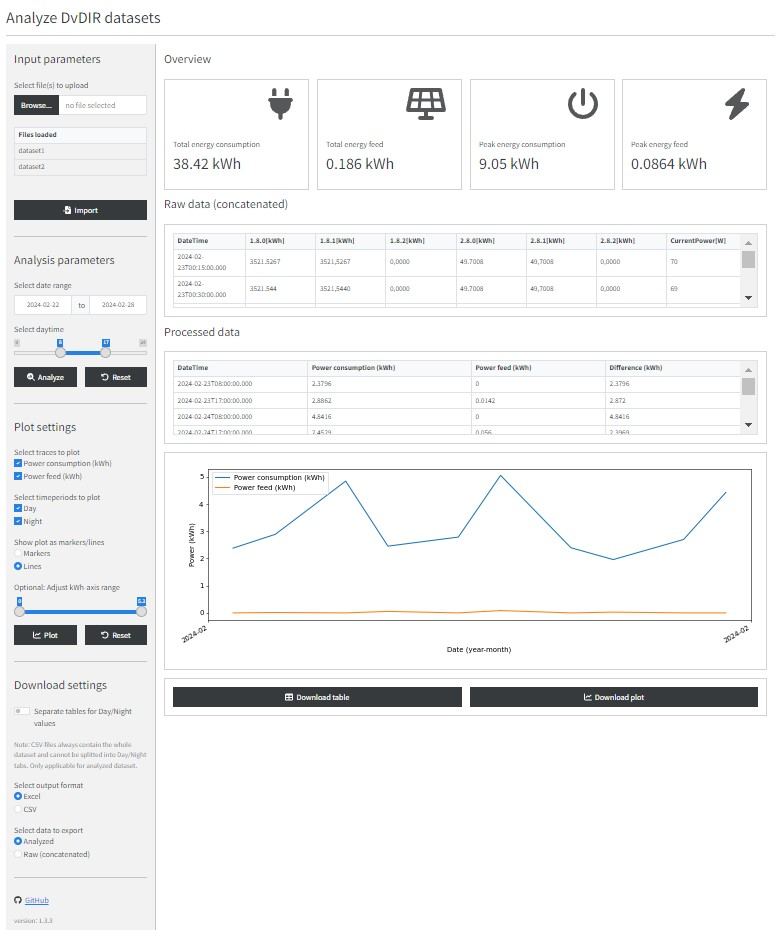

## DvLIR analyzer

### Overview
Python based Shiny application for the analysis of Smart Meter data (DvLIR). For a live application visit shinyapps.io: https://daheym.shinyapps.io/dvlir-analyzer/. 

### How to use
- Upload one or multiple .csv files that are exported from the DvLIR device
- The data is automatically concatenated, sorted ny date and duplicates are removed
- Select the *date range* of interest and use the *daytime* slider to determine which hours is considered as Day in the analysis
- A click on the **Run analysis** button analyzes the data according to your settings and plots the timecurves
- Customize the plot and export the plot and/or the data

### Note
If you want to process a lot of data and/or use the app frequently, please consider cloning the repo and run the app locally (e.g. in WSL/Ubuntu).

### Requirements
- Python 3.12
- pandas, matplotlib
- openpyxl
- shiny, shinyswatch
- faicons

### UI Overview
